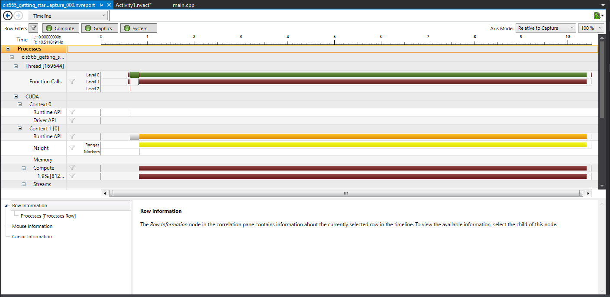
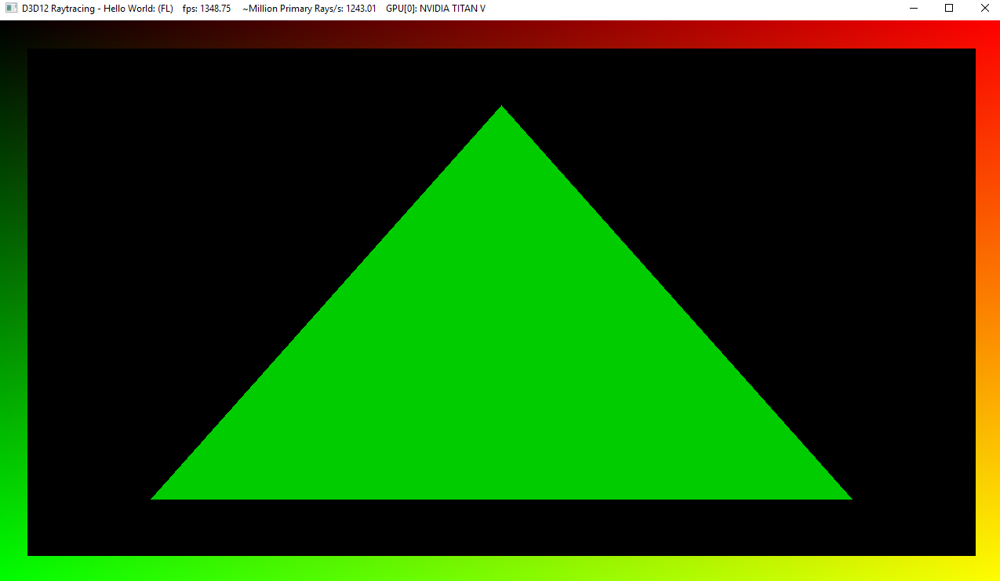

Project 0 Getting Started
====================

**University of Pennsylvania, CIS 565: GPU Programming and Architecture, Project 0**

* (TODO) DAVIS POLITO
  * (TODO) [https://www.linkedin.com/in/davis-polito-b58a22113/](), , , etc.
* Tested on: (TODO) Windows 10, Intel Zeon CPU E5-2687W v3 @ 3.1 GHz, NVIDIA TITAN V (SIGLAB VR-1)

### (TODO: Your README)

COMPUTE CAPABILITY - 7.0

Include screenshots, analysis, etc. (Remember, this is public, so don't put
anything here that you don't want to share with the world.)

